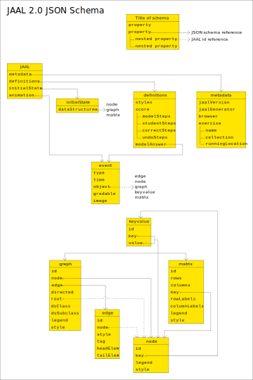

# JAAL - JSON-based Algorithm Animation Language

## Introduction

This repository contains technical documentation, specification and examples
for JSON-based Algorithm Animation Language (JAAL). The language is intended
to support computing education research in universities. JAAL is a JSON-based
data format to store students' answers to visual algorithm simulation /
algorithm visualization exercises. In practice, it has been designed to
record students' answers to interactive exercises made with
[http://jsav.io](JSAV) that are included in
[https://opendsa-server.cs.vt.edu/](OpenDSA) .

## Features

- Specification in [JSON Schema](https://json-schema.org/)
- Semantic data
  - Data structures: arrays (1D, 2D), lists, trees, graphs
  - Exercise instance (input to algorithm to be simulated)
  - Student's solution and Model solution events
    - click a data structure
    - undo    
    - event timing
- Graphical data
  - Embedded [SVG images](https://developer.mozilla.org/en-US/docs/Web/SVG):
    exercise instance, student's solution steps, model solution steps
- Extendable
    
- Flexible
  - Custom fields can be added (e.g. priority queue operations)
  - Recursive nesting of data structures
  - Format design is independent of JSAV

## Overview of schema

This section gives an overview of JAAL 2.0 JSON Schema structure along with
basic design principles of JAAL.

The figure above is a top-level map of JAAL 2.0 JSON Schema. Each
yellow box with titles such as **initialState**, **animation**, e.g. are 
*subschemas*. The box with title **JAAL** is the top level schema.
Each subschema has *properties* (dictionary keys). The **JAAL** schema has
property `metadata` which has a *JSON Schema reference* to subschema
**metadata**.

The subschema **metadata** itself has properties such as `jaalVersion` and
`browser`. These may be numbers or string values. The `exercise` property
of the **metadata** subschema is a dictionary itself with keys `name`,
`collection`, and `runningLocation`.

The **initialState** subschema contains data structures represented in
algorithm visualization exercises. It is actually a list of data structures,
and each data structure must have the format of one of the subschemas
**node**, **graph**, or **matrix**.

The **event** subschema has property `object` which also refers to five
subschemas representing data structures (edge, node, graph, keyvalue, matrix).
However, here the arrow line is dashed, meaning it is a *JAAL id reference*.
Each JAAL data structure object has an `id` property which is a string.
This way instances of subschemas can refer to each other without having to
nest them: by default, an **event** refers to an existing data structure
defined in the **initialState** schema. 

(The C programming language analogy between a JSON Schema reference
and a JAAL id reference are structs and pointers.)

The JAAL 2.0 JSON Schema has five data structure schemas. The most atomic
data structure subschema is **node** which may either a graph node or a cell
in an array or matrix. Subschema **matrix** represents both one- and
two-dimensional arrays.

Subschema **graph** represents all kinds of linked,
expandable data structures: lists, trees, and graphs. Each graph contains a
set of **node**s and a set of **edge**s. Each edge is a pair of nodes.
Because directed graphs may have some bidirectional edges, it is conventional
to define separately the set of nodes and then refer to them by their `id`
properties in edges; this is why the `node` property of the **edge**
subschema is a JAAL ID reference and not a JSON Schema reference.

## Data Examples

See [examples/README.md](examples/README.md) for a full example on what kind of
exercises JAAL can record and what the data looks like.

See the subdirectory [spec/test/valid/](spec/test/valid/) for JAAL examples of
different data structures typically occurring in algorithm visualization
exercises. This test data has examples of:
- [linked list](spec/test/valid/graph-linkedlist-bidirectional.json)
- [binary search tree](spec/test/valid/graph-binary-search-tree.json)
- [red-black tree](spec/test/valid/graph-red-black-tree.json)
- [weighted graph](spec/test/valid/graph-undirected-weighted.json)
- [directed graph](spec/test/valid/graph-directed.json)
- [array](spec/test/valid/matrix-1d-vertical.json)
- [2D array](spec/test/valid/matrix-2d.json)

## Scientific Literature

To read more about the design and purpose of JAAL, see the following
publication.

Artturi Tilanterä, Giacomo Mariani, Ari Korhonen, Otto Seppälä. [Towards a JSON-based Algorithm Animation Language](https://doi.org/10.1109/VISSOFT52517.2021.00026) In *2021 Working Conference on Software Visualization (VISSOFT)*. IEEE, 2021.

The first prototype of JAAL was originally developed as a master's thesis at
Aalto University: Giacomo Mariani. [Design of an Application to Collect Data and Create Animations
from Visual Algorithm Simulation Exercises.](http://urn.fi/URN:NBN:fi:aalto-202005313418) Master's thesis, Aalto University School of Science, 2020.

## Specification

The current version for JAAL is 2.0.

JAAL 2.0 has a formal specification in [JSON Schema](https://json-schema.org/).
The JSON Schema for JAAL is in the subdirectory `spec`.

JAAL 1.0 has no formal specification; it is implicitly specified by its
model implementation.

### Demonstrations

JAAL 2.0 can be tested with the testbench of
[JSAV Exercise Recorder](https://github.com/Aalto-LeTech/jsav-exercise-recorder/blob/jaal2.0/README.md#introduction-with-testbench).

[A demo of JAAL 1.0](https://jsav-player-test-app.web.app) features the
following exercises: Insertion Sort, Heap Build, Dijkstra's algorithm,
Evaluating Postfix Expression, and search in a Binary Search Tree.

### Software

#### JAAL 2.0

* [JSAV Exercise
  Recorder 2.0](https://github.com/Aalto-LeTech/jsav-exercise-recorder/tree/jaal2.0)
  (git branch `jaal2.0`) records at least Prim's and Dijkstra's JSAV exercises.
  See [Introduction with testbench](https://github.com/Aalto-LeTech/jsav-exercise-recorder/blob/jaal2.0/README.md#introduction-with-testbench) in the main README of the Exercise Recorder's repository.

* [JSAV Exercise Player
  2.0](https://github.com/Aalto-LeTech/jsav-exercise-player/tree/jaal2.0) (git
  branch `jaal2.0`) is designed to play JAAL 2.0 recordings. However, it is not
  under active development.

#### JAAL 1.0

* [JSAV Exercise Recorder](https://github.com/MarianiGiacomo/jsav-exercise-recorder/)
saves student's solution for a [JSAV](http://jsav.io)/[OpenDSA](https://opendsa-server.cs.vt.edu/) exercise as JAAL 1.0.

* [JSAV Exercise Player](https://github.com/MarianiGiacomo/jsav-exercise-player/)
plays a JAAL 1.0 recording.

* [JSAV Player Application Server](https://github.com/MarianiGiacomo/jsav-player-application-test-server) is the backend of the demonstration application. It implements an
exercise service which provides JSAV/OpenDSA exercises and stores JAAL 1.0
recordings.

* [JSAV Player Application Test App](https://github.com/MarianiGiacomo/jsav-player-application-test-app) is the frontend of the demonstration application.
